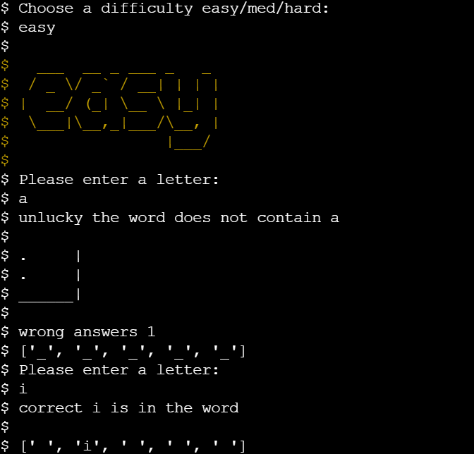

# Hangman Animal edition
- 
- [Live Website](https://hangman-animal-edition.herokuapp.com/)
- [Github Repository](https://github.com/jenns93/hangman_animal_edition)
 # About
Classic Hangman game, running in the Code Institute mock terminal on Heroku.

Players need to guess the correct word before the hangman picture is complete.
## Table of Contents

- [How To Play](#How-To-Play)
- [Design](#Design)

- [Features](#Features)
- [Specific to Pages](#Specific-to-Pages)

- [Technologies Used](#Technologies-Used)

- [Testing](#Testing)

- [Deployment](#Deployment)

- [Bugs](#Bugs)

- [Credits](#Credits)

## How To Play
Players can select between three difficulties, easy, medium and hard.
Players will then have nine attempts to guess the animal before the hangman picture is complete.
## Design
### Colour scheme
- 
### Typography
- 

## Features

- Users are welcomed to the game with the title screen displaying the game title and promting the to initiate the game.
- Players will then need to select between three difficulties, easy, medium and hard. As difficulty increases animal words that are more obsqure and or longer words are selected from the word dictionary.
- Players are then asked to provide their letter guess.
- When guess is submitted the program will give feedback on whether the input was valvid then whether or not the letter guessed was in the word.
- If players guess was correct the word is displayed with the correct letter visable and the letters still not guessed hidden with an underscore.

- If input is not in the word the hangman picture is displayed along with a wrong answer counter.
- The hangman picture is iterated through as users get wrong answers until the last stage of the picture is displayed.
- Game over is displayed when the player reaches nine wrong answers without completing the word, the word they were attempting to guess is also displayed.

- If the player guesses all of the letters in the word then WINNER is displayed.

- Win or Lose when the game is complete the player is asked wether they want to play again, yes or no.
- If yes is selected the player is brought back to the difficulty menu.
- If no is selected the player is returned to the title screen.   
## Specific to Pages
### Game
- 
### Future Features
-   
## Technologies Used

### Languages Used

- 

### Frameworks, libraries and programs used

-[Heroku](https://dashboard.heroku.com/apps) Heroku was used to host the files and to publish the finished program.

-[Gitpod](https://www.gitpod.io/) Gitpod was used to code the website and commit changes throughout the development to Github.

## Testing

### Functionality Testing
#### Navigation

- 
#### Options
- 
#### Game
- 
### PEP8 - 

### Usability Testing

-

### Testing User Stories

i.
1.

## Deployment
### Heroku
- 

1. 

### Forking the GitHub Repository
To contribute you can Fork without affecting the main branch. Follow the instructions outlined below.

1. Go to GitHub and log in.
2. Find the Repository that was used for this project.
3. To the right of the Repository name you will see the 'Fork' button. This is located next to the 'Start' and 'Watch' buttons.
4. Doing this will place a copy in your own repository.
5. When you are finished locating the 'New Pull Request' button above the file list on the original repository.

### Cloning
- To clone or download the repository to your own device follow the instructions listed below.

1. Head to Github and log in.
2. Find the Repository for this site.
3. Below the name of the repository find the 'Clone or Download' green button.
4. To clone the repo using HTTPS click the link below "Clone with HTTPS".
5. Open your Terminal and go to the directory you want the cloned directory to be copied to.
6. Enter "Git Clone" and paste the URL copied from GitHub.
7. Create your local clone by pressing "Enter".

## Bugs
-

## Credits

#### Code

- Code institute walkthrough “love Sandwiches” for Python structure layout 
- Code institute Python essentials. 
- Stackoverflow for tips, examples concepts for further understanding of language definitions.
- w3schools for tips, examples concepts for further understanding of language definitions.
- GeeksforGeeks for examples for understanding language better.

#### Content

- All code written by the author - Jack Jenns

- To create the README file inspiration was taken from:

- Code Institute [SampleREADME](https://github.com/Code-Institute-Solutions/SampleREADME)
- Code Institute [README Template](https://github.com/Code-Institute-Solutions/readme-template)
- [Markdown cheat sheet](https://github.com/adam-p/markdown-here/wiki/Markdown-Cheatsheet)

### Acknowledgements
- Stackoverflow.
- Fellow students on slack.
- My mentor for his guidance.
- w3schools. 
- GeeksforGeeks

